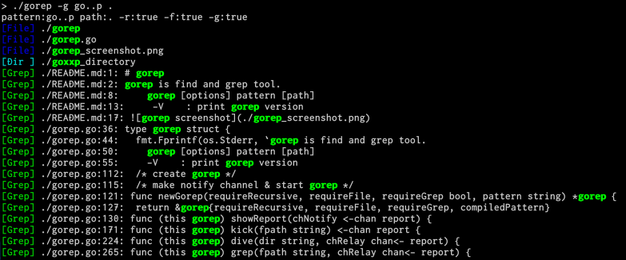

# gorep
gorep is find and grep tool.

## Usage
```
Usage:

    gorep [options] pattern [path]

The options are:

    -V               : print gorep version
    -g               : enable grep
    -grep-only       : enable grep and disable file search
    -search-binary   : search binary files for matches on grep enable
    --ignore pattern : pattern is ignored
    -hidden          : search hidden files
```

## ScreenShot


